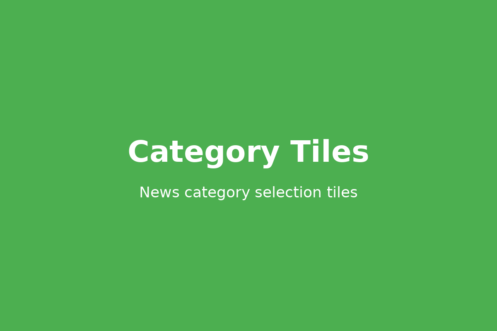
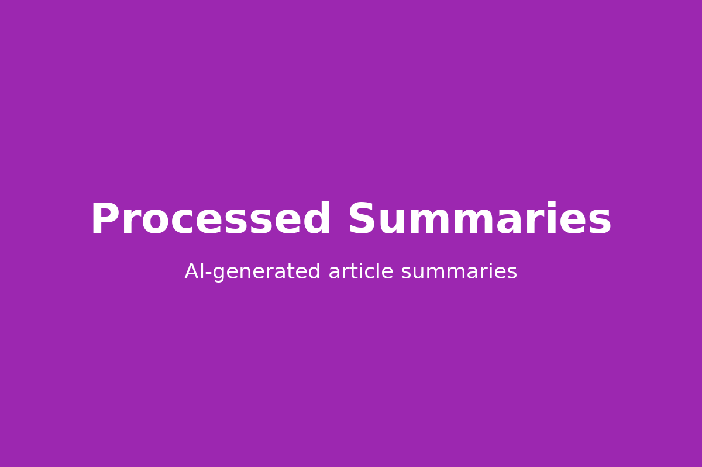

# NewsDigest – Real-Time News ETL & Summarizer

_A production-style data product that ingests world news in real time, enriches it with NLP summaries, optionally streams events through Kafka, and surfaces the results through a polished Flask UI._

## Why It Stands Out
- **Hybrid ETL pipeline**: REST ingestion → cleansing → TextRank summarization → optional Kafka streaming → MySQL persistence.
- **Recruiter-friendly UI**: Bootstrap 5 pages for discovery (`/`), search results (`/search`), and curated summaries (`/summaries`).
- **Cloud-ready configuration**: every secret (API keys, DB creds, broker hosts) lives in `.env`, making Docker, Render, or EC2 deployments frictionless.
- **Extensible analytics**: PySpark hooks are scaffolded so you can bolt on model training or feature engineering without reworking the core app.
- **Tested fail-safes**: graceful degradation when Kafka/Spark aren’t installed, HTML sanitization, and defensive DB handling keep demos smooth.

## Architecture at a Glance
```
NewsAPI -> Flask ingestion -> Text cleaning/Summarization -> [optional] Kafka topic ->
Kafka consumer -> MySQL (news_etl DB) -> Flask views & REST API
```

| Layer | Responsibility | Tech |
| --- | --- | --- |
| Ingestion | Search NewsAPI by topic/category, rate-limit friendly | `requests`, Flask |
| Enrichment | Strip HTML, summarize with TextRank graph | `nltk`, `numpy`, `networkx` |
| Streaming (opt) | Publish/consume JSON events | `confluent-kafka` |
| Storage | Schema-managed article warehouse | `mysql-connector-python` |
| Presentation | Responsive Bootstrap UI + JSON API | Flask, Jinja, Bootstrap 5 |

## Product Tour (Screenshots)

### Landing Page
The main hero section with search functionality allows users to discover news by topic or category.


### Category Selection
Browse news by pre-defined categories with intuitive tile-based navigation.



### Search Results
Articles are displayed in a clean, responsive card grid showing headlines, sources, and publish dates.


### AI-Generated Summaries
View processed article summaries powered by TextRank NLP, making it easy to scan key points.



## Quickstart
1. **Clone + env setup**
   ```bash
   git clone https://github.com/Maneesh3110/newsdigest-realtime-etl.git
   cd newsdigest-realtime-etl
   python -m venv .venv && source .venv/bin/activate
   ```
2. **Install requirements**
   ```bash
   pip install -r requirements.txt
   ```
3. **Provision secrets**
   ```bash
   cp .env.example .env
   # edit .env and fill in NewsAPI + MySQL credentials
   ```
4. **Start dependencies**
   - MySQL server running and reachable (the app will create `news_etl`).
   - Optional Kafka broker if `ENABLE_KAFKA=true`.
   - Optional PySpark if `ENABLE_SPARK=true`.
5. **Run it**
   ```bash
   python app.py
   ```
   Visit `http://localhost:5000` to search articles, view summaries, or hit `/api/articles` for JSON.

## Environment Variables
| Variable | Purpose | Default |
| --- | --- | --- |
| `NEWS_API_KEY` | NewsAPI credential (required). | — |
| `NEWS_LOOKBACK_DAYS` | Topic search lookback window. | `7` |
| `NEWS_LANGUAGE` | News language filter. | `en` |
| `NEWS_FALLBACK_COUNTRY` | Country for top-headline fallback. | `us` |
| `NEWS_SORT_BY` | Sorting strategy for `everything` endpoint. | `publishedAt` |
| `ENABLE_KAFKA` | Toggle Kafka producer/consumer. | `false` |
| `KAFKA_BOOTSTRAP_SERVERS` | Broker host list. | `localhost:9092` |
| `KAFKA_TOPIC` | Topic used for streaming articles. | `news_articles` |
| `ENABLE_SPARK` | Toggle PySpark session bootstrap. | `false` |
| `MYSQL_HOST` / `MYSQL_PORT` | DB connection target. | `localhost` / `3306` |
| `MYSQL_USER` / `MYSQL_PASSWORD` | Credentials with CREATE privileges. | `root` / _empty_ |
| `MYSQL_DB_NAME` | Target schema (auto-created). | `news_etl` |

## Optional Upgrades
- **Docker Compose**: add `mysql`, `zookeeper`, `kafka`, and the Flask app as services for one-command spin up.
- **Scheduled jobs**: wire `cron`/`Airflow` to hit `/search` for curated terms every hour.
- **Analytics notebooks**: point PySpark to the same MySQL warehouse for feature engineering or trend analysis.

## Local Dev Workflow
```bash
source .venv/bin/activate
pip install -r requirements.txt
cp .env.example .env  # keep .env private
python app.py
```

## Deployment Tips
- Use managed MySQL (RDS, PlanetScale) and set the host/user/password in the platform’s secret store.
- For container platforms, pass env vars through orchestrator secrets; `python-dotenv` ensures local/dev parity.
- If Kafka isn’t available in prod, leave `ENABLE_KAFKA=false`—the app downgrades to a direct DB ingest path.

## Version Control Hygiene
- `.env`, virtual environments, compiled files, and local DB artifacts are ignored via `.gitignore`.
- Use feature branches for experimentation, then open PRs to `main` for review-ready work.

---

_Questions or want to see it live? Ping me at [LinkedIn](https://www.linkedin.com/) or open an issue in the repo._
